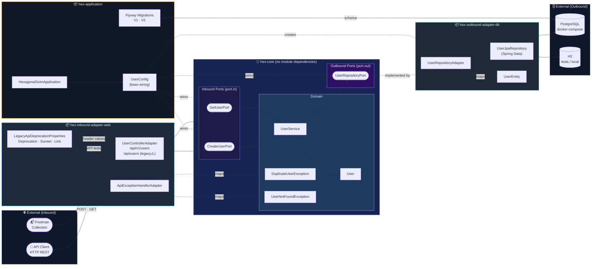

# hexagonal-scim

Production-grade multi-module Spring Boot service using hexagonal architecture.

## Project Structure

```
hexagonal-scim/
├── Dockerfile
├── docker-compose.yml
├── pom.xml                                          # Root aggregator POM
│
├── documenttaion/diagrams/
│   ├── diag-component.puml                          # Component diagram
│   └── diag-sequence.puml                           # Sequence diagram
│
├── hex-core/                                        # Domain + ports (no dependencies on other modules)
│   └── src/main/java/com/example/user/
│       ├── model/
│       │   └── User.java
│       ├── core/
│       │   ├── UserService.java
│       │   ├── DuplicateUserException.java
│       │   └── UserNotFoundException.java
│       └── port/
│           ├── in/
│           │   ├── CreateUserPort.java
│           │   └── GetUserPort.java
│           └── out/
│               └── UserRepositoryPort.java
│
├── hex-inbound-adapter-web/                         # REST adapter → depends on hex-core
│   └── src/main/java/com/example/user/
│       ├── api/
│       │   ├── UserControllerAdapter.java
│       │   ├── ApiExceptionHandlerAdapter.java
│       │   └── dto/
│       │       ├── CreateUserRequest.java
│       │       ├── UserResponse.java
│       │       └── ErrorResponse.java
│       └── config/
│           └── LegacyApiDeprecationProperties.java
│
├── hex-outbound-adapter-db/                         # JPA adapter → depends on hex-core
│   └── src/main/java/com/example/user/adapter/db/
│       ├── UserRepositoryAdapter.java
│       ├── UserJpaRepository.java
│       └── UserEntity.java
│
├── hex-application/                                 # Boot entry + wiring → depends on all modules
│   └── src/main/
│       ├── java/com/example/user/
│       │   ├── HexagonalScimApplication.java
│       │   └── config/
│       │       └── UserConfig.java
│       └── resources/
│           ├── application.yml
│           ├── application-docker.yml
│           └── db/migration/
│               ├── V1__create_users_table.sql
│               └── V2__next_change_template.sql
│
└── postman/
    ├── hexagonal-scim.postman_collection.json
    └── local.postman_environment.json
```

## Architecture

```
                        ┌─────────────────────────────┐
                        │   hex-inbound-adapter-web   │
                        │  ┌───────────────────────┐  │
          HTTP REST ───►│  │ UserControllerAdapter │  │
          (v1 + legacy) │  │ ApiExceptionHandler   │  │
                        │  │ LegacyDeprecation      │  │
                        │  │       Props            │  │
                        └──┼───────────────────────┼──┘
                           │      port.in           │
              ┌────────────▼────────────────────────▼─────────────┐
              │                  hex-core                          │
              │   ╔══════════════════════════════════╗             │
              │   ║   CreateUserPort  GetUserPort    ║  port.in   │
              │   ╠══════════════════════════════════╣             │
              │   ║          UserService             ║  domain    │
              │   ║    User  ·  DuplicateUserEx      ║             │
              │   ║         UserNotFoundException    ║             │
              │   ╠══════════════════════════════════╣             │
              │   ║       UserRepositoryPort         ║  port.out  │
              │   ╚══════════════════════════════════╝             │
              └────────────┬────────────────────────┬─────────────┘
                           │      port.out           │
                        ┌──┼───────────────────────┼──┐
                        │  │ UserRepositoryAdapter │  │
          PostgreSQL ◄──│  │ UserJpaRepository     │  │
          H2 (tests) ◄──│  │ UserEntity            │  │
                        │  └───────────────────────┘  │
                        │   hex-outbound-adapter-db   │
                        └─────────────────────────────┘

     ┌──────────────────────────────────────────────────────────┐
     │                    hex-application                        │
     │   HexagonalScimApplication  ·  UserConfig (bean wiring)  │
     │   application.yml  ·  application-docker.yml             │
     │   Flyway: V1__create_users_table  ·  V2__template        │
     └──────────────────────────────────────────────────────────┘

  Module dependency rules:
  hex-inbound-adapter-web ──► hex-core
  hex-outbound-adapter-db ──► hex-core
  hex-application         ──► all modules
  hex-core                ──► (none)
```

## Architecture (Interactive)



> **Dependency rule**: arrows between modules only flow inward toward `hex-core`.  
> `hex-application` is the only module that depends on all others and owns all bean wiring.

## Modules

- `hex-core`: domain, input/output ports, and use cases.
- `hex-inbound-adapter-web`: REST API adapter (`api`) that depends on `hex-core`.
- `hex-outbound-adapter-db`: JPA persistence adapter that depends on `hex-core`.
- `hex-application`: runnable Spring Boot app and wiring (`config`) that depends on all modules.

## Database migrations

- Schema is migration-driven with Flyway.
- Initial migration is at `hex-application/src/main/resources/db/migration/V1__create_users_table.sql`.
- Hibernate is configured with `ddl-auto: validate` so startup fails if schema and mappings diverge.

## Production release checklist

- Flyway baseline strategy:
  - For existing databases without Flyway history, run a one-time baseline before the first migration deployment.
  - Keep the baseline version documented and aligned across environments.
- Rollback expectations:
  - Treat migrations as forward-only in production.
  - Roll back with a new corrective migration, or restore from backup for critical recovery.
- Post-deploy smoke checks:
  - Confirm app startup logs show Flyway migration success.
  - Verify expected versions in `flyway_schema_history`.
  - Run a minimal read/write API smoke test for changed tables.

## API versioning

- Current endpoint version is `/api/v1/users`.
- Legacy `/api/users` remains temporarily available for backward compatibility.

## Postman

- Collection: `postman/hexagonal-scim.postman_collection.json`
- Environment: `postman/local.postman_environment.json`
- Create requests generate `uniqueEmail` automatically when it is empty.

## Build

```bash
mvn -B clean verify
```

## Run

```bash
mvn -pl hex-application spring-boot:run
```

## Run With Docker Compose

```bash
docker compose up --build
```

## Quick test

```bash
curl -i -X POST http://localhost:8080/api/v1/users \
  -H 'Content-Type: application/json' \
  -d '{"email":"alice@example.com","displayName":"Alice"}'

curl -i http://localhost:8080/api/v1/users/1
```
