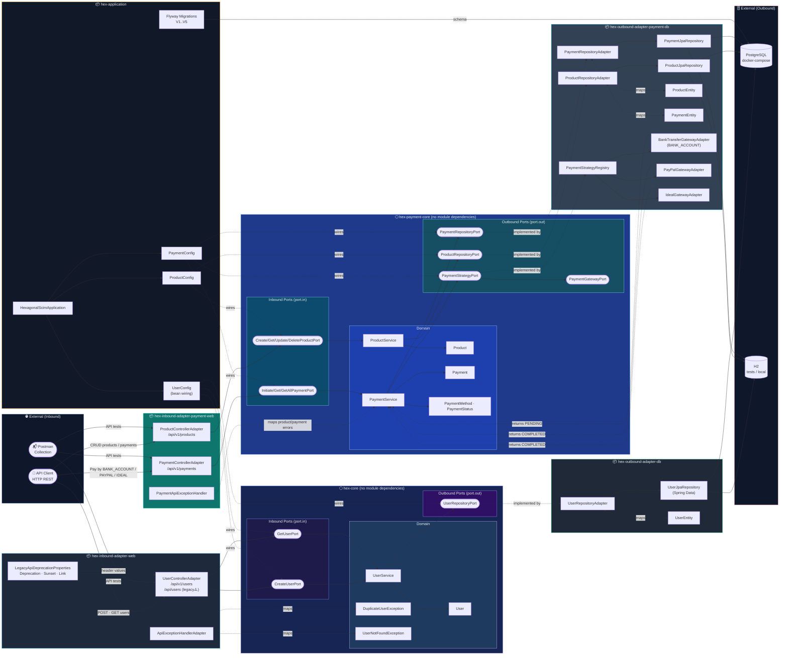

# hexagonal-scim

Production-grade multi-module Spring Boot service using hexagonal architecture.

Quick links: [Frontend Quick Start](#frontend-quick-start)

## Contents

1. [How to run me](#how-to-run-me)
2. [Full Stack Quick Start](#full-stack-quick-start)
3. [Run Everything EXCEPT Backend](#run-everything-except-backend-debug-from-intellij)
4. [Run Everything EXCEPT FE](#run-everything-except-fe)
5. [Diagrams](#diagrams)
6. [Project Structure](#project-structure)
7. [Architecture](#architecture)
8. [Modules](#modules)
9. [Database migrations](#database-migrations)
10. [Production release checklist](#production-release-checklist)
11. [API versioning](#api-versioning)
12. [Endpoints](#endpoints)
13. [Frontend](#frontend)
14. [Build](#build)
15. [Run With Docker Compose](#run-with-docker-compose)
16. [Authentication (Keycloak)](#authentication-keycloak)

# How to run me

## Full Stack Quick Start
Run the full stack (frontend + backend + Keycloak + DB):

```bash
docker compose up --build
```

Then open `https://localhost:3000`.

- Login: `testuser / password` (or `adminuser / password`)
- Keycloak admin: `https://localhost:8443`
- First visit uses a self-signed cert; accept the browser warning for local dev.

## Run Everything EXCEPT Backend (Debug from IntelliJ)
Debug or test backend APIs with Postman (collection and environment included in `postman/`)::
```shell
# Terminal 1: Start all services except the app
docker compose up --build --scale app=0

# This brings up:
# ✅ PostgreSQL (5432)
# ✅ Keycloak (8443)
# ✅ Nginx/Frontend (3000)
# ✅ All observability stack (Prometheus, Grafana, Fluent Bit, Splunk)
```
Debug Backend from IntelliJ:
1. Set active profile to `docker` (enables Docker-friendly config).
2. Run `HexagonalScimApplication` in debug mode.
3. Set breakpoints in backend code (e.g. `PaymentService.initiatePayment`).
4. Trigger API calls from Postman or frontend to hit breakpoints.
5. Inspect variables, step through code, and verify behavior.
6. Check logs in terminal and Postman responses for expected results.
7. Stop services with `docker compose down` when done.
   8. IntelliJ Setup for debugging:
         
   
         Run → Edit Configurations → + New → Remote JVM Debug
         Set Host: localhost, Port: 5005

         Access URLs:
         Frontend: https://localhost:3000
         Backend API: http://localhost:8080
         Keycloak: https://localhost:8443

Debug Backend from IntelliJ with mvn:
```bash
# Terminal 2: Run backend with IDE debugger
mvn -pl hex-application spring-boot:run

# OR with debugging on port 5005:
mvn -pl hex-application spring-boot:run \
  -Dspring-boot.run.jvmArguments="-agentlib:jdwp=transport=dt_socket,server=y,suspend=n,address=5005"
````
## Run Everything EXCEPT FE
and 2️⃣ Run Everything EXCEPT Frontend (Debug from IntelliJ/Browser Dev Tools)
Start Services (without frontend):
```bash 
# Terminal 1: Start all services except frontend
docker compose up --build --scale hexagonal-scim-frontend=0

# This brings up:
# ✅ PostgreSQL (5432)
# ✅ Keycloak (8443)
# ✅ Spring Boot Backend (8080)
# ✅ All observability stack
```

Run Frontend Dev Server:
```bash
# Terminal 2: Start Vite dev server with hot reload
cd frontend
npm install
npm run dev

# expected output
#  VITE v5.x.x  ready in 123 ms

#  ➜  Local:   http://localhost:5173/
#  ➜  press h to show help
```
Access URLs:
Frontend: http://localhost:5173
Backend API: http://localhost:8080
Keycloak: https://localhost:8443

Debug Frontend:
Open http://localhost:5173 in Chrome
Press F12 → Sources tab
Edit files in your IDE (e.g., frontend/src/components/...)
Vite auto-refreshes the browser (hot module replacement)
Set breakpoints in DevTools Sources tab


# Diagrams
## Project Structure

```
hexagonal-scim/
├── Dockerfile
├── docker-compose.yml
├── pom.xml                                          # Root aggregator POM
│
├── documenttaion/diagrams/
│   ├── diag-component.puml                          # Component diagram
│   └── diag-sequence.puml                           # Sequence diagram
│
├── hex-core/                                        # Domain + ports (no dependencies on other modules)
│   └── src/main/java/com/example/user/
│       ├── model/
│       │   └── User.java
│       ├── core/
│       │   ├── UserService.java
│       │   ├── DuplicateUserException.java
│       │   └── UserNotFoundException.java
│       └── port/
│           ├── in/
│           │   ├── CreateUserPort.java
│           │   └── GetUserPort.java
│           └── out/
│               └── UserRepositoryPort.java
│
├── hex-inbound-adapter-web/                         # REST adapter → depends on hex-core
│   └── src/main/java/com/example/user/
│       ├── api/
│       │   ├── UserControllerAdapter.java
│       │   ├── ApiExceptionHandlerAdapter.java
│       │   ├── config/
│       │   │   ├── LegacyApiDeprecationProperties.java
│       │   │   ├── ApiPaginationProperties.java
│       │   │   └── OpenApiConfig.java
│       │   └── dto/
│       │       ├── CreateUserRequest.java
│       │       ├── UserResponse.java
│       │       ├── PagedUserResponse.java
│       │       └── ErrorResponse.java
│
├── hex-outbound-adapter-db/                         # JPA adapter → depends on hex-core
│   └── src/main/java/com/example/user/adapter/db/
│       ├── UserRepositoryAdapter.java
│       ├── UserJpaRepository.java
│       └── UserEntity.java
│
├── hex-payment-core/                                # Product/Payment domain + ports (no dependencies on other modules)
│   └── src/main/java/com/example/user/
│       ├── model/
│       │   ├── Product.java
│       │   ├── Payment.java
│       │   ├── PaymentMethod.java
│       │   └── PaymentStatus.java
│       ├── core/
│       │   ├── ProductService.java
│       │   └── PaymentService.java
│       └── port/
│           ├── in/
│           │   ├── CreateProductPort.java
│           │   └── InitiatePaymentPort.java
│           └── out/
│               ├── ProductRepositoryPort.java
│               ├── PaymentRepositoryPort.java
│               ├── PaymentGatewayPort.java
│               └── PaymentStrategyPort.java
│
├── hex-inbound-adapter-payment-web/                 # Payment/Product REST adapter → depends on hex-payment-core
│   └── src/main/java/com/example/user/api/payment/
│       ├── ProductControllerAdapter.java
│       ├── PaymentControllerAdapter.java
│       ├── PaymentApiExceptionHandler.java
│       └── dto/
│
├── hex-outbound-adapter-payment-db/                 # Payment/Product JPA + strategy adapters → depends on hex-payment-core
│   └── src/main/java/com/example/user/
│       ├── adapter/payment/db/
│       ├── adapter/payment/
│       └── config/
│
├── hex-application/                                 # Boot entry + wiring → depends on all modules
│   └── src/main/
│       ├── java/com/example/user/
│       │   ├── HexagonalScimApplication.java
│       │   └── config/
│       │       ├── UserConfig.java
│       │       ├── ProductConfig.java
│       │       └── PaymentConfig.java
│       └── resources/
│           ├── application.yml
│           ├── application-docker.yml
│           └── db/migration/
│               ├── V1__create_users_table.sql
│               ├── V2__next_change_template.sql
│               ├── V3__add_sample_users.sql
│               ├── V4__create_products_table.sql
│               ├── V5__create_payments_table.sql
│               └── V6__seed_base_cat_house.sql
│
└── postman/
    ├── hexagonal-scim.postman_collection.json
    └── local.postman_environment.json
```

## Architecture

```
   USER FLOW
                        ┌─────────────────────────────┐
                        │   hex-inbound-adapter-web   │
                        │  ┌───────────────────────┐  │
          HTTP REST ───►│  │ UserControllerAdapter │  │
                        │  │ ApiExceptionHandler   │  │
                        └──┼───────────────────────┼──┘
                           │      port.in           │
              ┌────────────▼────────────────────────▼─────────────┐
              │                  hex-core                          │
              │   ╔══════════════════════════════════╗             │
              │   ║   CreateUserPort  GetUserPort    ║  port.in   │
              │   ╠══════════════════════════════════╣             │
              │   ║          UserService             ║  domain     │
              │   ║    User · Duplicate/UserNotFound ║             │
              │   ╠══════════════════════════════════╣             │
              │   ║       UserRepositoryPort         ║  port.out   │
              │   ╚══════════════════════════════════╝             │
              └────────────┬────────────────────────┬─────────────┘
                           │      port.out           │
                        ┌──┼───────────────────────┼──┐
                        │  │ UserRepositoryAdapter │  │
          PostgreSQL ◄──│  │ UserJpaRepository     │  │
          H2 (tests) ◄──│  │ UserEntity            │  │
                        │  └───────────────────────┘  │
                        │   hex-outbound-adapter-db   │
                        └─────────────────────────────┘


   PRODUCT/PAYMENT FLOW
                   ┌───────────────────────────────────────┐
                   │  hex-inbound-adapter-payment-web      │
                   │  ┌─────────────────────────────────┐  │
    HTTP REST ────►│  │ ProductControllerAdapter       │  │
                   │  │ PaymentControllerAdapter       │  │
                   │  │ PaymentApiExceptionHandler     │  │
                   │  └─────────────────────────────────┘  │
                   └───────────────┬───────────────────────┘
                                   │ port.in
              ┌────────────────────▼────────────────────────────┐
              │               hex-payment-core                   │
              │ ╔══════════════════════════════════════════════╗ │
              │ ║ Create/Get/Update/DeleteProductPort          ║ │
              │ ║ Initiate/Get/GetAllPaymentPort               ║ │
              │ ╠══════════════════════════════════════════════╣ │
              │ ║ ProductService · PaymentService              ║ │
              │ ║ Product · Payment · PaymentMethod/Status     ║ │
              │ ╠══════════════════════════════════════════════╣ │
              │ ║ ProductRepositoryPort · PaymentRepositoryPort║ │
              │ ║ PaymentStrategyPort · PaymentGatewayPort     ║ │
              │ ╚══════════════════════════════════════════════╝ │
              └───────────────┬───────────────────────┬─────────┘
                              │ port.out              │ strategy
               ┌──────────────▼──────────────┐    ┌──▼────────────────────────┐
               │ hex-outbound-adapter-       │    │ hex-outbound-adapter-      │
               │ payment-db (JPA)            │    │ payment-db (Gateway impls) │
               │ Product/Payment RepoAdapter │    │ BankAccount/PayPal/IDEAL   │
               │ ProductEntity/PaymentEntity │    │ PaymentStrategyRegistry     │
               └──────────────┬──────────────┘    └────────────────────────────┘
                              │
                      PostgreSQL / H2


     ┌────────────────────────────────────────────────────────────┐
     │                      hex-application                       │
     │  HexagonalScimApplication                                 │
     │  UserConfig · ProductConfig · PaymentConfig (bean wiring)│
     │  Flyway: V1 users · V4 products · V5 payments            │
     └────────────────────────────────────────────────────────────┘

  Module dependency rules:
  hex-inbound-adapter-web ──► hex-core
  hex-outbound-adapter-db ──► hex-core
  hex-inbound-adapter-payment-web ──► hex-payment-core
  hex-outbound-adapter-payment-db ──► hex-payment-core
  hex-application         ──► all modules
  hex-core                ──► (none)
  hex-payment-core        ──► (none)
```

## Architecture (Interactive)



> **Dependency rule**: arrows between modules only flow inward toward `hex-core` or `hex-payment-core`.  
> `hex-application` is the only module that depends on all others and owns all bean wiring.

## Modules

- `hex-core`: domain, input/output ports, and use cases.
- `hex-inbound-adapter-web`: REST API adapter (`api`) that depends on `hex-core`.
- `hex-outbound-adapter-db`: JPA persistence adapter that depends on `hex-core`.
- `hex-payment-core`: product/payment domain, input/output ports, and use cases.
- `hex-inbound-adapter-payment-web`: product/payment REST API adapter that depends on `hex-payment-core`.
- `hex-outbound-adapter-payment-db`: product/payment JPA + payment strategy adapter that depends on `hex-payment-core`.
- `hex-application`: runnable Spring Boot app and wiring (`config`) that depends on all modules.

## Dependency Boundaries (Enforced)

The repository enforces a strict hexagonal dependency direction: dependencies point inward to core modules, and integration tests run only in `hex-application`.

| Module | Role | May depend on | Must not depend on | Test type allowed in module |
|---|---|---|---|---|
| `hex-core` | User domain + ports | JDK (+ test libs) | Spring Web/Data/JPA, adapters, application | Unit tests only |
| `hex-payment-core` | Product/payment domain + ports | JDK (+ test libs) | Spring Web/Data/JPA, adapters, application | Unit tests only |
| `hex-inbound-adapter-web` | User HTTP adapter | `hex-core`, web/validation/security libs | DB adapters, `hex-application` | Unit/slice tests (no integration bootstrap) |
| `hex-inbound-adapter-payment-web` | Product/payment HTTP adapter | `hex-payment-core`, web/validation libs | DB adapters, `hex-application` | Unit/slice tests (no integration bootstrap) |
| `hex-outbound-adapter-db` | User persistence adapter | `hex-core`, Spring Data/JPA | Inbound adapters, `hex-application` | Unit tests only |
| `hex-outbound-adapter-payment-db` | Product/payment persistence + strategy adapter | `hex-payment-core`, Spring Data/JPA | Inbound adapters, `hex-application` | Unit tests only |
| `hex-application` | Composition root + runtime wiring | All modules + runtime infra (`Flyway`, DB drivers, Boot starters) | N/A | Integration tests (`@SpringBootTest`, Testcontainers) |

- Integration-style tests are blocked outside `hex-application` by `scripts/enforce-integration-tests-location.sh` (executed during Maven `validate`).
- Runtime DB drivers are owned by `hex-application`; adapter modules stay runtime-agnostic.

#### PR checklist (hexagonal constraints)

- [ ] No integration tests outside `hex-application`.
- [ ] No DB drivers declared in adapter `pom.xml` files.
- [ ] Adapter dependencies are inward-only (no adapter-to-adapter coupling).
- [ ] Full verification passed: `mvn -B clean verify`.

## Database migrations

- Schema is migration-driven with Flyway.
- Migrations live in `hex-application/src/main/resources/db/migration/`:
  - `V1__create_users_table.sql` — Initial schema with users table.
  - `V2__next_change_template.sql` — Placeholder for future changes.
  - `V3__add_sample_users.sql` — Sample data (25 test users) for local development and testing.
  - `V4__create_products_table.sql` — Product catalog schema.
  - `V5__create_payments_table.sql` — Payment transaction schema.
  - `V6__seed_base_cat_house.sql` — Seeds the single sellable product `BaseCatHouse`.
  - `V7__create_accounts_table.sql` — Creates user-owned accounts (`user` 1 -> N `accounts`).
- Hibernate is configured with `ddl-auto: validate` so startup fails if schema and mappings diverge.

## Production release checklist

- Flyway baseline strategy:
  - For existing databases without Flyway history, run a one-time baseline before the first migration deployment.
  - Keep the baseline version documented and aligned across environments.
- Rollback expectations:
  - Treat migrations as forward-only in production.
  - Roll back with a new corrective migration, or restore from backup for critical recovery.
- Post-deploy smoke checks:
  - Confirm app startup logs show Flyway migration success.
  - Verify expected versions in `flyway_schema_history`.
  - Run a minimal read/write API smoke test for changed tables.

## API versioning

- Current endpoint version is `/api/v1/users`.
- Legacy `/api/users` remains temporarily available for backward compatibility.
- All endpoints support pagination with `?page=0&size=20` query parameters (optional, defaults shown).

## Endpoints

- `POST   /api/v1/users`        — Create a new user
- `GET    /api/v1/users`        — List all users (paginated), e.g., `GET /api/v1/users?page=0&size=10`
- `GET    /api/v1/users/{id}`   — Get a user by ID
- `POST   /api/v1/users/{id}/accounts`            — Create account for a user
- `GET    /api/v1/users/{id}/accounts`            — List accounts for a user
- `GET    /api/v1/users/{id}/accounts/{accountId}`— Get account by ID for a user
- `POST   /api/v1/users/{id}/accounts/{accountId}/topup` — Top up account balance (requires `ROLE_ADMIN`)
- `DELETE /api/v1/users/{id}/accounts/{accountId}`— Delete account for a user
- `PUT    /api/v1/users/{id}`   — Full replacement — both `email` and `displayName` required
- `PATCH  /api/v1/users/{id}`   — Partial update — at least one of `email` or `displayName`
- `DELETE /api/v1/users/{id}`   — Delete a user (returns `204 No Content`)
- `/api/users`                  — Legacy paths (deprecated, returns `Deprecation`, `Sunset`, `Link` headers)
- `POST   /api/v1/products`     — Create product
- `GET    /api/v1/products`     — List products
- `GET    /api/v1/products/{id}`— Get product by ID
- `PUT    /api/v1/products/{id}`— Update product
- `DELETE /api/v1/products/{id}`— Delete product
- `POST   /api/v1/payments`     — Initiate payment (`BANK_ACCOUNT`, `PAYPAL`, `IDEAL`), optional `currency` (`EUR` default, `USD` supported)
- `GET    /api/v1/payments`     — List payments
- `GET    /api/v1/payments/{id}`— Get payment by ID

> **Current production phase**: product catalog is read-only and only `BaseCatHouse` is sellable.
> Payment attempts for other product types are rejected.

## API Documentation (Swagger UI)

- **Swagger UI**: `http://localhost:8080/swagger-ui.html`
- **OpenAPI JSON spec**: `http://localhost:8080/api-docs`

Paths are configurable via `springdoc.swagger-ui.path` and `springdoc.api-docs.path` in `application.yml`.

## Postman

- Collection: `postman/hexagonal-scim.postman_collection.json`
- Environments: `postman/local.postman_environment.json` (no auth), `postman/local-docker.postman_environment.json` (with Keycloak)
- Run **Keycloak → Get Token — testuser** first; the JWT is stored automatically and used by all API requests.

## Newman (CLI API tests)

- Main v2 collection: `postman/hexagonal-scim-v2.postman_collection.json`
- Step-by-step guide: `TESTING.md`

```bash
# Install Newman once
npm install -g newman

# Run v2 collection (local mode)
newman run postman/hexagonal-scim-v2.postman_collection.json

# Run with local environment file
newman run postman/hexagonal-scim-v2.postman_collection.json -e postman/local.postman_environment.json

# Run in docker/auth mode environment
newman run postman/hexagonal-scim-v2.postman_collection.json -e postman/local-docker.postman_environment.json
```

## Frontend

A TypeScript + Web Components single-page frontend is included in the `frontend/` directory.

**Technology stack**: Web Components · Vite · TypeScript · keycloak-js

**Current features**: Keycloak SSO login redirect (PKCE), lifecycle-aware auth states, profile panel (username/roles/token expiry), deterministic logout redirect.

### Run frontend in development mode

```bash
# Terminal 1 — backend API
mvn -pl hex-application spring-boot:run

# Terminal 2 — frontend dev server with hot-reload (port 3000)
cd frontend
npm install
npm run dev
```

Open `http://localhost:3000`.

> In dev mode the Vite proxy forwards `/api/*` to `http://localhost:8080`, so there is no CORS issue.
> For local Keycloak login in frontend dev mode, use `frontend/.env.example` as reference and set `VITE_KEYCLOAK_*` values in `frontend/.env`.

### Debug Backend from IntelliJ IDE

Run everything **except** the backend app, then launch backend from your IDE with debugger:

```bash
# Terminal 1 — start all services except backend
docker compose up --build --scale app=0

# Terminal 2 — run backend with debugging on port 5005
mvn -pl hex-application spring-boot:run \
  -Dspring-boot.run.jvmArguments="-agentlib:jdwp=transport=dt_socket,server=y,suspend=n,address=5005"
```

**IntelliJ Setup:**
1. **Run** → **Edit Configurations** → **+ New** → **Remote JVM Debug**
2. Set `Host: localhost`, `Port: 5005`
3. Click **Debug** button (green bug icon)
4. Set breakpoints in code — they will trigger when requests hit

**Access:** Frontend `https://localhost:3000` → calls backend `http://localhost:8080`

### Debug Frontend with Vite Hot Reload

Run everything **except** the frontend, then launch Vite dev server with live reload:

```bash
# Terminal 1 — start all services except frontend container
docker compose up --build --scale hexagonal-scim-frontend=0

# Terminal 2 — start Vite dev server with hot reload
cd frontend
npm install
npm run dev
```

**Vite Dev Output:**
```
  VITE v5.x.x  ready in 123 ms
  ➜  Local:   http://localhost:5173/
  ➜  press h to show help
```

**Debug Frontend:**
1. Open `http://localhost:5173` in Chrome
2. Press **F12** → **Sources** tab
3. Edit files in `frontend/src/` — Vite auto-refreshes browser
4. Set breakpoints in DevTools **Sources** tab

**Access:** Frontend `http://localhost:5173` (hot reload) → calls backend `http://localhost:8080`

### Quick Reference — Debug Workflows

| Scenario | Command | Port | Debug Tool |
|----------|---------|------|-----------|
| **Debug Backend** | `docker compose up --scale app=0` then `mvn ... spring-boot:run -Dspring-boot.run.jvmArguments=...` | 8080 | IntelliJ Remote Debug (5005) |
| **Debug Frontend** | `docker compose up --scale hexagonal-scim-frontend=0` then `cd frontend && npm run dev` | 5173 | Browser DevTools + Hot Reload |
| **Full Stack** | `docker compose up --build` | 3000 | Browser DevTools only |

### Key Notes

✅ **Backend debug**: IDE uses local Maven build; all code changes reload after rebuild  
✅ **Frontend debug**: Vite proxy forwards `/api/*` to backend (no CORS issues)  
✅ **Keycloak**: Always running; login flow works in debug workflows  
✅ **Database**: PostgreSQL in Docker, accessible from both debug modes  
✅ **Hot reload**: Frontend auto-refreshes on file save; backend requires rebuild  
✅ **Port isolation**: Services use standard ports (8080, 5173, 5432, 8443)

### Run everything with Docker Compose (with auth)

```bash
docker compose down -v && docker compose up --build

# Everything (app + full observability)
docker compose up --build

#App only — no observability tools
#Fast startup, no metrics/logs needed
docker compose -f docker-compose.yml up --build

#Everything but ports are internal only
#Staging / CI — no host port bindings
docker compose -f docker-compose.yml -f docker-compose.observability.yml up --build
```

Docker Compose automatically merges `docker-compose.override.yml` — this exposes port 8080 (backend) and 5432 (PostgreSQL) to the host for local development.

| Service | URL |
|---------|-----|
| Frontend (Web) | https://localhost:3000 |
| Backend (Spring Boot) | http://localhost:8080 (dev only — via override) |
| Keycloak admin | https://localhost:8443 |
| Prometheus | http://localhost:9090 (dev only — via override) |
| Grafana | http://localhost:3001  admin / admin (dev only — via override) |
| Splunk Web UI | http://localhost:8000  admin / Admin1234! (dev only — via override) |

**Production / CI — skip the dev override:**

```bash
docker compose -f docker-compose.yml up --build
```

Port 8080 is NOT exposed on the host. All external API traffic flows through Nginx on port 3000.

Login with `testuser / password` or `adminuser / password` — Keycloak redirects back to the frontend automatically.

> **Self-signed certificate**: the browser will show a security warning on first visit.  
> Click **Advanced → Proceed** (Chrome) or **Accept the Risk** (Firefox).  
> The cert lives in `docker/certs/` and is valid for 10 years.

## Build

```bash
mvn -B clean verify
```

## Run

```bash
mvn -pl hex-application spring-boot:run
```

## Run with PostgreSQL Profile

Switch to PostgreSQL by activating the `postgresql` profile (instead of default H2 in-memory):

```bash
mvn -pl hex-application spring-boot:run -Dspring-boot.run.arguments="--spring.profiles.active=postgresql"
```

Requires a PostgreSQL server on `localhost:5432` with:
- Database: `hexdb`
- User: `hexuser`
- Password: `hexpassword`

Alternatively, update `hex-application/src/main/resources/application-postgresql.yml` for different credentials/host.

## Run With Docker Compose

```bash
docker compose up --build
```

Starts four core services: **PostgreSQL** (5432), **Keycloak** (8443 on host), **Spring Boot app** (internal 8080, exposed on 8080 in dev override), and **Frontend** (https://localhost:3000).  
The `hexagonal-scim` realm, two clients, two test users, and two roles are imported automatically.

---

## Authentication (Keycloak)

> Full guide: `documenttaion/KEYCLOAK_LOCAL_DEVELOPMENT.md`

### Keycloak admin console

| URL | Username | Password |
|-----|----------|----------|
| https://localhost:8443 | `admin` | `admin` |

### Test users (realm: `hexagonal-scim`)

| Username | Password | Roles |
|----------|----------|-------|
| `testuser` | `password` | `user` |
| `adminuser` | `password` | `user`, `admin` |

### Get an access token

```bash
# Password grant — testuser
curl -sk -X POST \
  https://localhost:8443/realms/hexagonal-scim/protocol/openid-connect/token \
  -d "grant_type=password&client_id=hexagonal-scim-public&username=testuser&password=password" \
  | jq -r .access_token

# Client credentials — M2M
curl -sk -X POST \
  https://localhost:8443/realms/hexagonal-scim/protocol/openid-connect/token \
  -d "grant_type=client_credentials&client_id=hexagonal-scim-app&client_secret=hexagonal-scim-secret" \
  | jq -r .access_token
```

### Store token and call the API

```bash
TOKEN=$(curl -sk -X POST \
  https://localhost:8443/realms/hexagonal-scim/protocol/openid-connect/token \
  -d "grant_type=password&client_id=hexagonal-scim-public&username=testuser&password=password" \
  | jq -r .access_token)

curl -i http://localhost:8080/api/v1/users -H "Authorization: Bearer $TOKEN"
```

### Security behaviour

| Startup mode | JWT enforced? |
|---|---|
| `docker compose up` (Keycloak running) | ✅ Yes — `401` without valid token |
| `mvn spring-boot:run` (H2, no Keycloak) | ❌ No — open, dev convenience |

> **Self-signed cert**: use `curl -sk` (skip TLS verification) or trust the cert in your OS keychain. See `docker/certs/` for the cert file.

> **Postman**: import `postman/hexagonal-scim.postman_collection.json` and `postman/local-docker.postman_environment.json`.  
> Run **"Get Token — testuser"** first — it stores the JWT automatically and all subsequent API requests use it.

---

## TODO

### 🔴 Critical — Before Production

#### 🔴 CRITICAL 1 — Close port 8080 to the host

`app` in `docker-compose.yml` has `ports: "8080:8080"` which binds the backend HTTP port to `0.0.0.0` on the host. Any process on the machine (or the LAN if the firewall allows) can call `http://localhost:8080` directly, bypassing Nginx and sending unencrypted traffic containing JWT bearer tokens.

**Fix — remove the `ports` mapping from the `app` service:**

```yaml
# docker-compose.yml — BEFORE (dev)
app:
  ports:
    - "8080:8080"   # ← remove this in production

# docker-compose.yml — AFTER (production)
app:
  # No ports: — backend only reachable through Nginx on hexagonal-net
  expose:
    - "8080"        # internal Docker network only; tells Nginx which port to proxy
```

Nginx already proxies `/api/*` to `http://app:8080` on the internal `hexagonal-net` bridge — removing the host port binding closes the direct path without breaking anything.

---

#### 🔴 CRITICAL 2 — Replace self-signed TLS certificate

`docker/certs/server.crt` is a self-signed dev certificate. Browsers show a security warning, HSTS is not effective, and the cert cannot be pinned or validated by external services. **Do not use in staging or production.**

**Fix options (choose one based on environment):**

**Option A — Let's Encrypt (public server, automated renewal):**
```bash
# Install Certbot
brew install certbot   # macOS
# or: apt install certbot

# Obtain cert (requires port 80 open and a real domain)
certbot certonly --standalone -d yourdomain.com

# Certs land at:
#   /etc/letsencrypt/live/yourdomain.com/fullchain.pem  → server.crt
#   /etc/letsencrypt/live/yourdomain.com/privkey.pem    → server.key

# Mount into docker-compose.yml:
volumes:
  - /etc/letsencrypt/live/yourdomain.com/fullchain.pem:/etc/nginx/certs/server.crt:ro
  - /etc/letsencrypt/live/yourdomain.com/privkey.pem:/etc/nginx/certs/server.key:ro
```

**Option B — Corporate / internal CA (air-gapped / private network):**
```bash
# Generate CSR
openssl req -new -newkey rsa:2048 -nodes \
  -keyout server.key \
  -out server.csr \
  -subj "/CN=yourdomain.internal/O=YourOrg"

# Submit server.csr to your CA → receive server.crt (+ chain)
# Replace docker/certs/server.crt and server.key
# Distribute the CA root cert to browsers / OS trust stores
```

**Option C — AWS / GCP / Azure (cloud-managed TLS):**
- Terminate TLS at the load balancer (ACM, Cloud Armor, Azure Front Door)
- Remove TLS from Nginx entirely — the LB handles it
- Backend stays HTTP-only on the internal VPC network (same pattern as now, but properly isolated)

**Also update `KC_HTTPS_CERTIFICATE_FILE` in `docker-compose.yml`** to point to the new cert path for Keycloak.

---

| Priority | Item | Detail |
|----------|------|--------|
| 🟠 HIGH | **Rotate all default secrets** | `KEYCLOAK_ADMIN_PASSWORD: admin`, `hexagonal-scim-secret` client secret, DB passwords (`scim/scim`) are hardcoded defaults. Move to environment-specific secrets management (Vault, AWS Secrets Manager, Kubernetes Secrets). |
| 🟠 HIGH | **Restrict actuator exposure** | `/actuator/health` and `/actuator/info` are public. Audit before adding more endpoints. In production, bind actuator to a separate management port not exposed externally. |
| 🟡 MEDIUM | **Enable Keycloak production mode** | Keycloak runs with `start-dev` which disables caches, uses in-memory sessions, and is not hardened. Switch to `start` (production mode) with proper hostname configuration. |
| 🟡 MEDIUM | **Separate Keycloak database** | Keycloak and the app share the same PostgreSQL instance via `init-keycloak.sql`. Use separate database instances in production for failure isolation. |

---

## Versions

### v0.0.4 (2026-05-11)

**Observability — Prometheus + Grafana (metrics) + Splunk + Fluent Bit (logs)**

| Area | What was added |
|------|----------------|
| **Micrometer / Prometheus** | `micrometer-registry-prometheus` added. `/actuator/prometheus` exposed. Histogram buckets enabled for P50/P95/P99 latency. Metrics tagged with `application=hexagonal-scim`. |
| **Structured logging** | `logstash-logback-encoder 8.0` added. `logback-spring.xml` profile-aware: plain text locally, JSON to stdout + rolling file (`/app/logs/app.log`) in docker profile. |
| **Prometheus** | `docker/prometheus/prometheus.yml` — scrapes `app:8080/actuator/prometheus` every 10s. `prom/prometheus:v2.54.1`. |
| **Grafana** | `docker/grafana/` — auto-provisioned Prometheus datasource + custom Spring Boot 3 / JVM dashboard (11 panels: request rate, error rate, p50/p95/p99 latency, heap, CPU, threads, GC, per-endpoint breakdown). `grafana/grafana:11.3.2`. |
| **Fluent Bit** | `docker/fluent-bit/` — tails `/app/logs/app.log` from shared Docker volume, parses JSON, ships to Splunk HEC with retry. `fluent/fluent-bit:3.2`. |
| **Splunk** | `splunk/splunk:9.3` with HEC auto-configured via `SPLUNK_HEC_TOKEN`. Token: `11111111-1111-1111-1111-111111111111`. |
| **Docker Compose** | `app_logs` named volume added to base file (shared between app and Fluent Bit). Override adds all 4 observability services for local dev. New `docker-compose.observability.yml` for staging (no host port bindings, credentials from env vars). |
| **Documentation** | `documenttaion/OBSERVABILITY.md` — full guide: pipeline diagrams, search queries, PromQL reference, production checklist, troubleshooting. |


### v0.0.3 (2026-05-10)

**CI/CD pipeline — GitHub Actions, OWASP gate, Docker push, auto-tagging**

| Area | What was added |
|------|----------------|
| **CI workflow** | `.github/workflows/ci.yml` — triggers on every PR and push to `main`. Jobs: (1) `mvn -B clean verify`, (2) OWASP Dependency Check (CVSS ≥ 7 = fail), (3) multi-arch Docker build verification (no push). Test reports and OWASP HTML report uploaded as artifacts. |
| **Release workflow** | `.github/workflows/release.yml` — triggers on merge to `main`. Auto-increments patch version from latest `vX.Y.Z` git tag, pushes multi-arch images (`linux/amd64`, `linux/arm64`) to `ghcr.io` tagged `vX.Y.Z` + `latest`, creates annotated Git tag and GitHub Release with auto-generated PR-based notes. |
| **OWASP suppression** | `.github/owasp-suppressions.xml` — empty baseline; add entries when a CVE is false-positive or formally accepted/mitigated. |
| **Concurrency** | CI cancels in-flight runs for the same branch on rapid push. Release never cancels mid-run. |
| **Optional secret** | `NVD_API_KEY` — set in repo Settings → Secrets to raise NVD API rate limit and avoid scan throttling. |

---

### v0.0.2 (2026-05-10)

**Profile-based port exposure — port 8080 closed in production, open in local dev**

| Area | What changed |
|------|--------------|
| **`docker-compose.yml`** | Removed `ports: "8080:8080"` from `app` service. Uses `expose: "8080"` — backend is internal-only on `hexagonal-net`. |
| **`docker-compose.override.yml`** (NEW) | Auto-loaded by Docker Compose when running locally (`docker compose up`). Adds `ports: "8080:8080"` for backend Postman/curl access and `ports: "5432:5432"` for DB tools. |
| **CI / production** | Run `docker compose -f docker-compose.yml up` — override is skipped, port 8080 stays closed, all external traffic via Nginx HTTPS. |
| **Security posture** | JWT bearer tokens can no longer be intercepted via unencrypted `http://localhost:8080` in non-dev environments. |

---

### v0.0.2 (2026-05-10)

**HTTPS everywhere + Keycloak healthcheck fix**

| Area | What changed |
|------|--------------|
| **TLS** | Self-signed dev certificate generated (`docker/certs/server.crt` + `server.key`, RSA 2048, 10 yr, SAN: `localhost`, `keycloak`, `127.0.0.1`) |
| **Keycloak** | HTTPS on port **8443** (browser-facing). HTTP stays on 8180 internal-only for JWK-set fetch and healthcheck. `KC_HTTPS_CERTIFICATE_FILE/KEY_FILE` env vars configured |
| **Frontend Nginx** | HTTPS on port **443** (mapped to host 3000). HTTP 80 → 301 redirect. HSTS, X-Frame-Options, X-Content-Type-Options, Referrer-Policy headers added |
| **Keycloak healthcheck** | Fixed: KC 25 UBI image has no `curl`/`wget`. Replaced with `bash /dev/tcp` probe against the OIDC discovery endpoint on internal HTTP port 8180 |
| **Spring Boot** | Unchanged — fetches JWK via `http://keycloak:8180` internally (avoids self-signed cert trust issue) |
| **`docker-compose.yml`** | `VITE_KEYCLOAK_URL` → `https://localhost:8443`, cert volume mounted to KC and Nginx, port mapping `3000:443` |

---

### v0.0.1 (2026-05-10)

**Initial release — hexagonal architecture + Keycloak SSO + React frontend**

| Area | What was added |
|------|----------------|
| **Architecture** | Multi-module hexagonal layout: `hex-core`, `hex-payment-core`, `hex-inbound-adapter-web`, `hex-inbound-adapter-payment-web`, `hex-outbound-adapter-db`, `hex-outbound-adapter-payment-db`, `hex-application` |
| **API** | Full CRUD REST API (`POST`, `GET`, `PUT`, `PATCH`, `DELETE`) on `/api/v1/users` |
| **Legacy API** | Backward-compatible `/api/users` with `Deprecation`, `Sunset`, `Link` headers |
| **Pagination** | `GET /api/v1/users?page=0&size=10` with `PagedUserResponse` |
| **Persistence** | JPA + Flyway migrations (V1–V3). PostgreSQL in production, H2 in tests |
| **Security** | Spring Security OAuth2 Resource Server with Keycloak JWT validation. Conditional on `jwk-set-uri` / `issuer-uri` — disabled automatically for local H2 dev |
| **Keycloak** | Realm `hexagonal-scim`, two clients (`hexagonal-scim-public` PKCE, `hexagonal-scim-app` M2M), two users (`testuser`, `adminuser`), two roles (`user`, `admin`) |
| **Frontend** | React 18 + Vite + TypeScript + Tailwind CSS SPA at `http://localhost:3000`. PKCE login flow, paginated user table, create / edit / delete modals, role badges, automatic token refresh |
| **Docker** | Multi-stage `Dockerfile` (Maven build → `eclipse-temurin:17-jre-jammy`), `docker-compose.yml` with PostgreSQL + Keycloak + Spring Boot + React/Nginx |
| **Docs** | OpenAPI / Swagger UI, Postman collection with Keycloak auth, `KEYCLOAK_LOCAL_DEVELOPMENT.md` |

---

## Quick test

```bash
# Get a token first (when running via Docker Compose)
TOKEN=$(curl -sk -X POST \
  https://localhost:8443/realms/hexagonal-scim/protocol/openid-connect/token \
  -d "grant_type=password&client_id=hexagonal-scim-public&username=testuser&password=password" \
  | jq -r .access_token)

# Create a user
curl -i -X POST http://localhost:8080/api/v1/users \
  -H 'Content-Type: application/json' \
  -H "Authorization: Bearer $TOKEN" \
  -d '{"email":"alice@example.com","displayName":"Alice"}'

# Create an account for user 1
ACCOUNT_ID=$(curl -s -X POST http://localhost:8080/api/v1/users/1/accounts \
  -H 'Content-Type: application/json' \
  -H "Authorization: Bearer $TOKEN" \
  -d '{"name":"Primary"}' | jq -r .id)

# Get an admin token (top-up requires ROLE_ADMIN)
ADMIN_TOKEN=$(curl -sk -X POST \
  https://localhost:8443/realms/hexagonal-scim/protocol/openid-connect/token \
  -d "grant_type=password&client_id=hexagonal-scim-public&username=adminuser&password=password" \
  | jq -r .access_token)

# Top up account balance
curl -i -X POST http://localhost:8080/api/v1/users/1/accounts/$ACCOUNT_ID/topup \
  -H 'Content-Type: application/json' \
  -H "Authorization: Bearer $ADMIN_TOKEN" \
  -d '{"amount":100.00}'

# Initiate payment using userId + accountId
curl -i -X POST http://localhost:8080/api/v1/payments \
  -H 'Content-Type: application/json' \
  -H "Authorization: Bearer $TOKEN" \
  -d '{"userId":1,"accountId":'"$ACCOUNT_ID"',"productId":1,"quantity":1,"paymentMethod":"PAYPAL","currency":"EUR"}'

# List accounts for user 1
curl -i http://localhost:8080/api/v1/users/1/accounts -H "Authorization: Bearer $TOKEN"

# Get one account by id
curl -i http://localhost:8080/api/v1/users/1/accounts/$ACCOUNT_ID -H "Authorization: Bearer $TOKEN"

# Delete one account by id
curl -i -X DELETE http://localhost:8080/api/v1/users/1/accounts/$ACCOUNT_ID -H "Authorization: Bearer $TOKEN"

# Get all users (paginated, default page=0, size=10)
curl -i http://localhost:8080/api/v1/users -H "Authorization: Bearer $TOKEN"

# Get page 2 with 5 items per page
curl -i "http://localhost:8080/api/v1/users?page=1&size=5" -H "Authorization: Bearer $TOKEN"

# Get a user by ID
curl -i http://localhost:8080/api/v1/users/1 -H "Authorization: Bearer $TOKEN"

# Full replacement (PUT)
curl -i -X PUT http://localhost:8080/api/v1/users/1 \
  -H 'Content-Type: application/json' \
  -H "Authorization: Bearer $TOKEN" \
  -d '{"email":"alice2@example.com","displayName":"Alice Renamed"}'

# Partial update (PATCH) — only displayName changes, email is preserved
curl -i -X PATCH http://localhost:8080/api/v1/users/1 \
  -H 'Content-Type: application/json' \
  -H "Authorization: Bearer $TOKEN" \
  -d '{"displayName":"Alice Renamed"}'

# Delete a user
curl -i -X DELETE http://localhost:8080/api/v1/users/1 -H "Authorization: Bearer $TOKEN"

# Legacy endpoint (returns Deprecation headers)
curl -i http://localhost:8080/api/users/1 -H "Authorization: Bearer $TOKEN"
```
