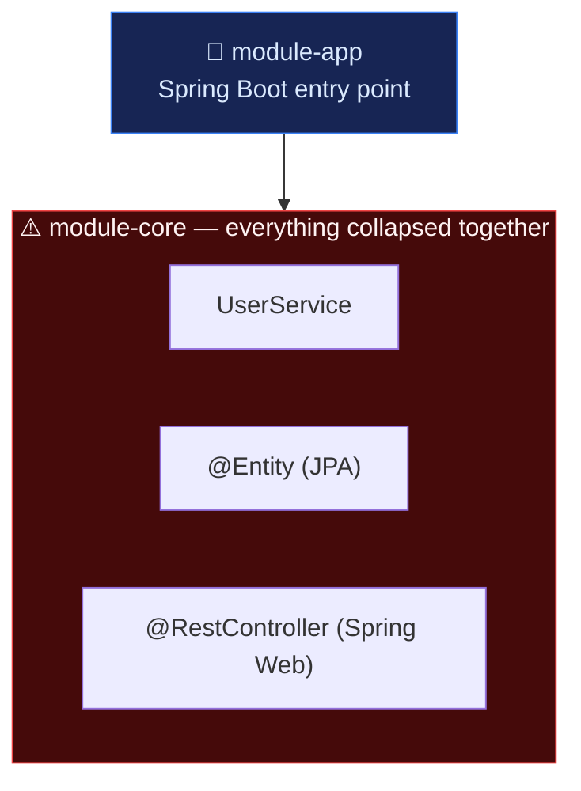
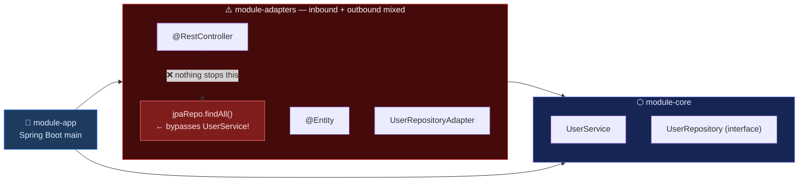
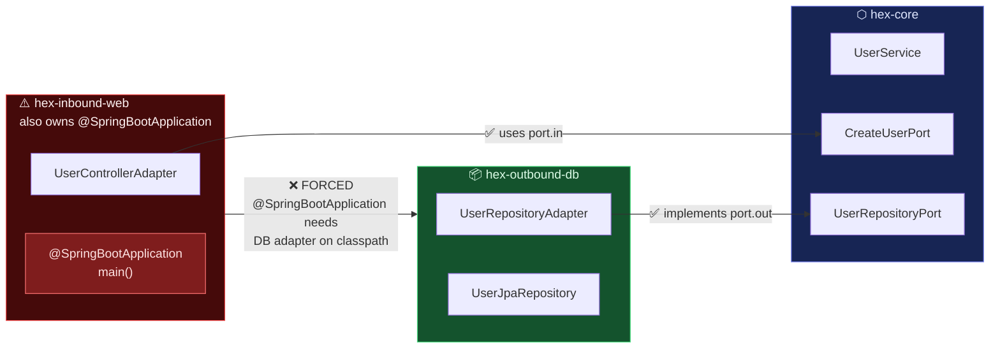
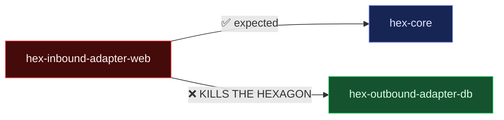
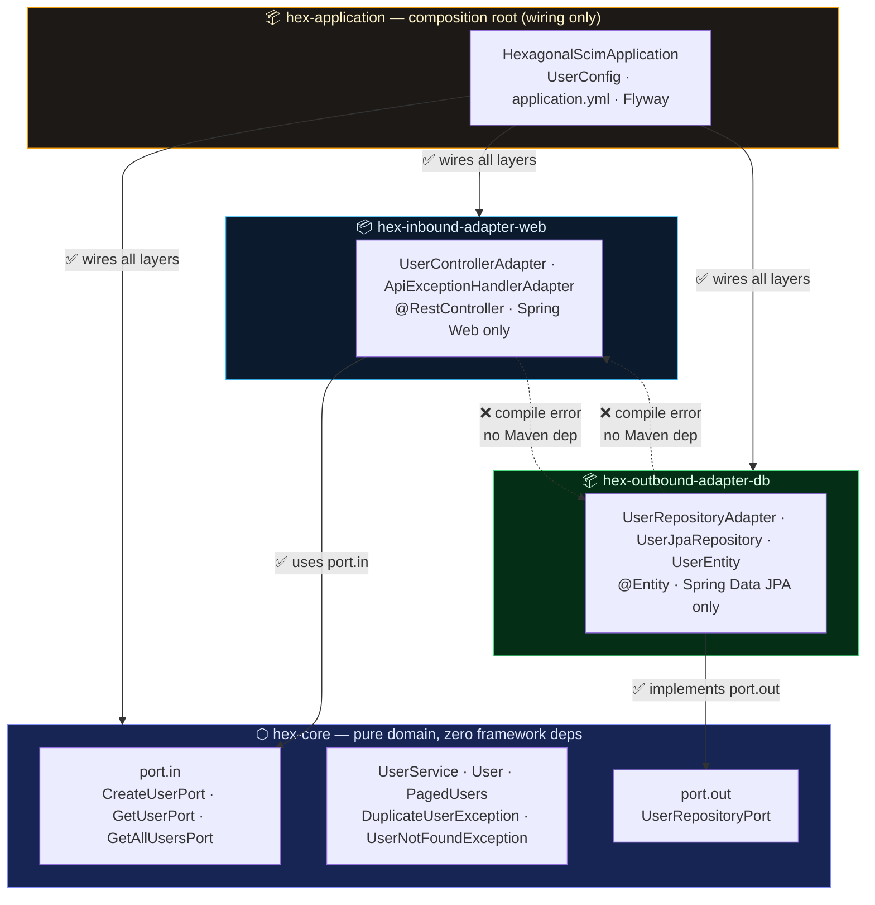
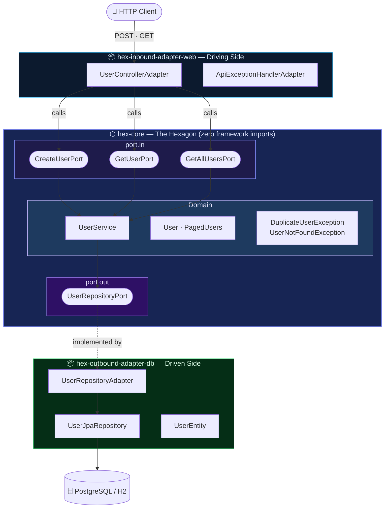
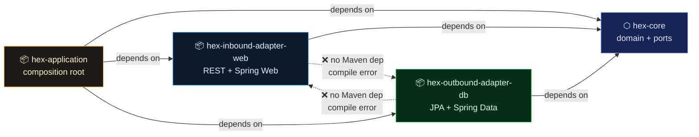
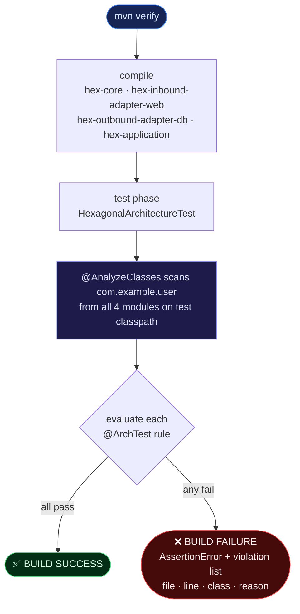
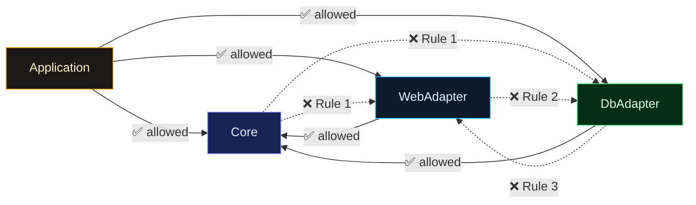

# Hexagonal Architecture — ArchUnit Test Guide

> **File**: `hex-application/src/test/java/com/example/user/HexagonalArchitectureTest.java`  
> **Library**: [ArchUnit](https://www.archunit.org/) `1.3.0` via `archunit-junit5`  
> **Runs on**: every `mvn verify` — architecture violations fail the build like any broken unit test

---

## Table of Contents

1. [Why Hexagonal Architecture Needs at Least 4 Modules](#1-why-hexagonal-architecture-needs-at-least-4-modules)
2. [The Hexagon Visualised](#2-the-hexagon-visualised)
3. [Module Map of This Project](#3-module-map-of-this-project)
4. [How ArchUnit Works](#4-how-archunit-works)
5. [The 7 Rules — What, Why, and What Would Break Them](#5-the-7-rules)
6. [Rule Dependency Matrix](#6-rule-dependency-matrix)
7. [What a Violation Looks Like](#7-what-a-violation-looks-like)
8. [Design Decisions and Trade-offs](#8-design-decisions-and-trade-offs)
9. [Extending the Rules](#9-extending-the-rules)

---

## 1. Why Hexagonal Architecture Needs at Least 4 Modules

This is the most important question to ask before writing a single test.

### The naive (broken) approach — 2 modules

Imagine you split a service into just two modules:



**What breaks?**

| Problem | Consequence |
|---------|-------------|
| `UserService` imports `@Entity` | Swapping PostgreSQL for MongoDB forces domain rewrites |
| `UserService` imports `@RestController` | Adding a GraphQL endpoint means touching business logic |
| All concerns live together | Every change risks regressions everywhere |
| Tests need Spring context to test pure logic | Slow feedback loops; tests become integration tests by default |

The two-module split collapses the hexagon into a monolith. You gain build isolation but **not architectural isolation**.

---

### The incomplete approach — 3 modules



This is better — domain and adapters are separated. But there is a fatal flaw:

> **The inbound adapter (REST) and outbound adapter (database) live in the same module.**

This means:

```java
// Inside module-adapters — nothing PREVENTS this:
@RestController
class UserController {

    @Autowired
    private UserJpaRepository jpaRepo;  // ← BYPASSES the domain entirely!
}
```

The controller reaches directly into the database repository, **skipping ports, skipping business logic, skipping validations**. No build tool will catch it. The hexagon is broken, silently.

---

---

### The other incomplete approach — 3 modules, no composition root

What if you go the other way — separate inbound and outbound adapters properly, but skip the dedicated wiring module?



The adapters are properly separated. The domain looks clean. But there is no `hex-application` module to act as the composition root. **What breaks?**

#### Problem 1: nowhere to put `@SpringBootApplication`

The Spring Boot main class and `@SpringBootApplication` have to live somewhere. It ends up in one of the three modules — most likely `hex-inbound-adapter-web` because that is where the web server starts:

```java
// hex-inbound-adapter-web — now also the entry point
@SpringBootApplication
public class Application {
    public static void main(String[] args) {
        SpringApplication.run(Application.class, args);
    }
}
```

This forces `hex-inbound-adapter-web` to depend on `hex-outbound-adapter-db` so Spring's component scan can find `UserRepositoryAdapter`. The dependency graph becomes:



The inbound adapter now has classpath visibility into the DB adapter. Rule 2 of the ArchUnit test would fire — and, more dangerously, a developer can now write:

```java
@RestController
class UserControllerAdapter {

    @Autowired
    private UserJpaRepository jpaRepo;  // ← compiles, runs, bypasses UserService
}
```

#### Problem 2: bean wiring is scattered and implicit

Without a composition root, Spring's auto-wiring assembles the application based on `@Component`, `@Service`, and `@Repository` annotations spread across all three modules. This means:

- There is **no single place** to read and understand how ports are connected to implementations.
- Swapping `UserRepositoryAdapter` for a different persistence technology requires hunting through annotations across multiple modules.
- Integration tests cannot easily replace one adapter with a test double without triggering the full component scan.

In `hex-application`, the explicit `UserConfig` makes wiring a two-line read:

```java
// UserConfig.java — the entire wiring is visible in one file
@Bean CreateUserPort createUserPort(UserRepositoryPort repo) { return new UserService(repo)::create; }
@Bean GetUserPort    getUserPort   (UserRepositoryPort repo) { return new UserService(repo)::getById; }
```

Without this file, that clarity vanishes into scattered `@Autowired` declarations.

#### Problem 3: Flyway migrations, `application.yml`, and profiles have no home

Database migration scripts, environment-specific configuration, and Spring profiles need to live in a module that is on the classpath at startup. Without `hex-application`:

- Flyway SQL files are placed in `hex-outbound-adapter-db` — coupling the DB adapter to startup lifecycle concerns.
- `application.yml` lives in the web adapter — coupling HTTP configuration to database concerns.
- Docker/cloud profiles (`application-docker.yml`, `application-postgresql.yml`) end up split or duplicated across modules.

The result is a module that is nominally an "adapter" but in reality also owns deployment, configuration, and lifecycle — not an adapter at all.

#### Summary: what 3 modules (no app) breaks

| What is missing | Consequence |
|-----------------|-------------|
| No composition root | `@SpringBootApplication` contaminates one adapter |
| No explicit wiring | Inbound adapter gains compile-time dependency on outbound adapter |
| No config home | `application.yml`, Flyway, profiles scattered or duplicated |
| No test seam | Cannot substitute a test double for one adapter without the full component scan |
| ArchUnit Rule 2 fires | `web_adapter_must_not_depend_on_db_adapter` broken by the forced Maven dependency |

---

### The correct approach — **minimum 4 modules**

Each concern gets a dedicated module whose **compile-time classpath physically prevents the wrong imports**.



| Module | Classpath sees | Cannot see (compile error) |
|--------|---------------|--------------------------|
| `hex-core` | Java stdlib | Any adapter |
| `hex-inbound-adapter-web` | `hex-core` + Spring Web | `hex-outbound-adapter-db` |
| `hex-outbound-adapter-db` | `hex-core` + Spring Data | `hex-inbound-adapter-web` |
| `hex-application` | All modules | — |

The **Maven dependency graph itself** enforces the first layer of protection. ArchUnit adds a second layer that catches **package-level** violations within the same classpath.

> 💡 **The minimum is 4 because you need: (1) pure domain, (2) at least one inbound adapter, (3) at least one outbound adapter, and (4) a composition root to wire them together. Merging any two loses a hard boundary.**

---

## 2. The Hexagon Visualised



**Key insight**: arrows _always_ point **inward**. The domain knows nothing about who calls it or where it stores data. This is the Dependency Inversion Principle applied at architectural scale.

---

## 3. Module Map of This Project

```
hexagonal-scim/
│
├── hex-core/                          ← THE HEXAGON (no framework deps)
│   └── com.example.user.
│       ├── model/          User, PagedUsers
│       ├── core/           UserService, DuplicateUserException, UserNotFoundException
│       └── port/
│           ├── in/         CreateUserPort, GetUserPort, GetAllUsersPort
│           └── out/        UserRepositoryPort
│
├── hex-inbound-adapter-web/           ← DRIVING ADAPTER (Spring Web only)
│   └── com.example.user.
│       ├── api/            UserControllerAdapter, ApiExceptionHandlerAdapter
│       │   └── dto/        CreateUserRequest, UserResponse, PagedUserResponse, ErrorResponse
│       └── config/         LegacyApiDeprecationProperties, ApiPaginationProperties, OpenApiConfig
│
├── hex-outbound-adapter-db/           ← DRIVEN ADAPTER (Spring Data JPA only)
│   └── com.example.user.
│       └── adapter.db/     UserRepositoryAdapter, UserJpaRepository, UserEntity
│
└── hex-application/                   ← COMPOSITION ROOT (wires everything)
    └── com.example.user.
        ├── HexagonalScimApplication
        └── config/         UserConfig (creates and injects all beans)
```

### Maven dependency graph



> `hex-inbound-adapter-web` and `hex-outbound-adapter-db` have **no classpath visibility** of each other at all. Maven enforces this. ArchUnit confirms it at the package level.

---

## 4. How ArchUnit Works

ArchUnit scans compiled `.class` bytecode — not source code — and runs your rules against the resulting class model at test time.



### Key annotation: `@AnalyzeClasses`

```java
@AnalyzeClasses(
    packages = "com.example.user",                  // scan root package
    importOptions = ImportOption.DoNotIncludeTests.class  // skip test classes
)
```

| Parameter | Purpose |
|-----------|---------|
| `packages` | Defines which packages to scan. Because `hex-application` depends on all sibling modules, ALL project classes end up on its test classpath. One scan covers everything. |
| `DoNotIncludeTests.class` | Prevents test classes themselves from being checked. Without this, `HexagonalArchitectureTest` would appear as an "Application layer" class referencing ArchUnit library types — causing spurious violations. |

---

## 5. The 7 Rules

### Rule 1 — `domain_must_not_depend_on_adapters`

```java
noClasses().that().resideInAnyPackage(CORE, MODEL, PORT_IN, PORT_OUT)
        .should().dependOnClassesThat()
        .resideInAnyPackage(WEB_API, DB_ADAPTER)
```

**In plain English**: Nothing inside the hexagon may import anything from an adapter.

```
✅ ALLOWED                              ❌ FORBIDDEN
─────────────────────────────────────────────────────
UserService  uses  UserRepositoryPort   UserService  uses  UserEntity
User         is    plain Java record    User         has   @Entity
CreateUserPort     is a Java interface  CreateUserPort     imports  @RequestBody
```

**Why it matters**: The moment `UserService` imports `UserEntity`, the domain is married to JPA. Replacing the database requires touching business logic.

---

### Rule 2 — `web_adapter_must_not_depend_on_db_adapter`

```java
noClasses().that().resideInAPackage(WEB_API)
        .should().dependOnClassesThat()
        .resideInAPackage(DB_ADAPTER)
```

**In plain English**: The REST controller layer must never import a JPA entity or repository.

```
✅ ALLOWED                              ❌ FORBIDDEN
──────────────────────────────────────────────────────────────
UserControllerAdapter  uses  CreateUserPort    UserControllerAdapter  uses  UserEntity
UserControllerAdapter  uses  GetUserPort       UserControllerAdapter  uses  UserJpaRepository
```

**Why it matters**: If the controller queries the database directly, you bypass validation, business rules, and transaction management defined in `UserService`.

---

### Rule 3 — `db_adapter_must_not_depend_on_web_adapter`

```java
noClasses().that().resideInAPackage(DB_ADAPTER)
        .should().dependOnClassesThat()
        .resideInAPackage(WEB_API)
```

**In plain English**: JPA entities and repositories may never import DTOs or controller classes.

```
✅ ALLOWED                              ❌ FORBIDDEN
──────────────────────────────────────────────────────────────
UserRepositoryAdapter  implements  UserRepositoryPort   UserEntity  uses  CreateUserRequest
UserEntity             maps to     User                 UserJpaRepository  uses  UserResponse
```

**Why it matters**: The database adapter must be independently deployable. A Kafka consumer or batch job should be able to reuse it without dragging in Spring Web.

---

### Rule 4 — `core_must_not_use_spring_web`

```java
noClasses().that().resideInAnyPackage(CORE, MODEL)
        .should().dependOnClassesThat()
        .resideInAPackage("org.springframework.web..")
```

**In plain English**: Business logic and domain model may not reference any Spring Web class.

```
✅ ALLOWED                              ❌ FORBIDDEN
────────────────────────────────────────────────────────────
UserService  throws  DuplicateUserException    UserService    has  @RestController
User         has     id, email, displayName    User           has  @RequestBody
```

**Why it matters**: If `UserService` carries `@Transactional` from `org.springframework.transaction` that's acceptable. If it ever imports `org.springframework.web.bind.annotation.*` the domain has leaked into the HTTP layer and can no longer be run in a CLI or message-driven context without Spring MVC on the classpath.

---

### Rule 5 — `core_must_not_use_jpa`

```java
noClasses().that().resideInAnyPackage(CORE, MODEL)
        .should().dependOnClassesThat()
        .resideInAnyPackage("jakarta.persistence..", "javax.persistence..")
```

**In plain English**: The domain model `User` is a plain Java record. It must never carry `@Entity`, `@Id`, or `@Column`.

```
// ✅ Domain model — pure Java
public record User(Long id, String email, String displayName) {}

// ❌ What must never happen — JPA leaking into domain
@Entity
public class User {
    @Id @GeneratedValue
    private Long id;
}
```

**Why it matters**: `@Entity` forces your domain object to satisfy ORM constraints (no-arg constructor, mutable fields, etc.) that are irrelevant to business logic. The `UserEntity` in the DB adapter exists precisely so `User` never needs to care about this.

---

### Rule 6 — `ports_must_be_framework_agnostic`

```java
noClasses().that().resideInAnyPackage(PORT_IN, PORT_OUT)
        .should().dependOnClassesThat()
        .resideInAnyPackage(
            "org.springframework.web..",
            "org.springframework.data..",
            "jakarta.persistence..",
            "javax.persistence.."
        )
```

**In plain English**: Port interfaces are the contract between the hexagon and the outside world. They must speak pure Java — no framework types in method signatures.

```java
// ✅ Port — pure Java interface
public interface CreateUserPort {
    User create(String email, String displayName);
}

// ❌ Port polluted with Spring — now every test needs Spring context
public interface CreateUserPort {
    ResponseEntity<User> create(@RequestBody CreateUserRequest request);
}
```

**Why it matters**: Ports are the most stable part of the architecture. If they import framework types, they force every consumer — including unit tests — to have those frameworks on the classpath. This is the most common way hexagonal architecture quietly collapses.

---

### Rule 7 — `layered_architecture_rule`

```java
layeredArchitecture()
    .consideringOnlyDependenciesInLayers()
    .layer("Core").definedBy(CORE, MODEL, PORT_IN, PORT_OUT)
    .layer("WebAdapter").definedBy(WEB_API)
    .layer("DbAdapter").definedBy(DB_ADAPTER)
    .layer("Application").definedBy("com.example.user")
    .whereLayer("Core").mayNotAccessAnyLayer()
    .whereLayer("WebAdapter").mayOnlyAccessLayers("Core")
    .whereLayer("DbAdapter").mayOnlyAccessLayers("Core")
    .whereLayer("Application").mayOnlyAccessLayers("Core", "WebAdapter", "DbAdapter")
```

**In plain English**: A single declarative statement that reasserts rules 1–6 as a layered architecture with allowed access directions.



**Why `consideringOnlyDependenciesInLayers()`?** Without this flag (using `consideringAllDependencies()`), ArchUnit treats every dependency target — including `java.lang.Object`, `org.springframework.*`, `jakarta.persistence.*` — as subject to layer checks. Since those packages are not in any defined layer, every single class in every layer would generate hundreds of false violations simply for calling `super()` or using `@Entity`. The `consideringOnlyDependenciesInLayers()` flag scopes checks to **only the inter-layer dependencies defined above**.

**Why is `com.example.user.config` unassigned?** The `config` package name is shared by two modules:

```
hex-inbound-adapter-web  →  com.example.user.config.LegacyApiDeprecationProperties
hex-inbound-adapter-web  →  com.example.user.config.ApiPaginationProperties
hex-inbound-adapter-web  →  com.example.user.config.OpenApiConfig
hex-application          →  com.example.user.config.UserConfig
```

Assigning `com.example.user.config..` to "Application" would make `UserControllerAdapter` (WebAdapter) look like it's accessing the Application layer (forbidden). Assigning it to "WebAdapter" would make `UserConfig` (which wires all layers) look like it's in WebAdapter. Rules 1–6 already guard these classes with targeted `noClasses()` assertions, so the layered rule deliberately leaves `config` unassigned.

---

## 6. Rule Dependency Matrix

This matrix shows which package combinations each rule covers. ✅ = allowed, ❌ = forbidden (rule fires), — = not checked by this rule.

|  From → To | `core` | `model` | `port.in` | `port.out` | `api` | `adapter.db` |
|:-----------|:------:|:-------:|:---------:|:----------:|:-----:|:------------:|
| `core`     | ✅ same | ✅ same  | ✅ same    | ✅ same     | ❌ R1  | ❌ R1         |
| `model`    | ✅ same | ✅ same  | ✅ same    | ✅ same     | ❌ R1  | ❌ R1         |
| `port.in`  | ✅ same | ✅ same  | ✅ same    | ✅ same     | ❌ R1  | ❌ R1         |
| `port.out` | ✅ same | ✅ same  | ✅ same    | ✅ same     | ❌ R1  | ❌ R1         |
| `api`      | ✅      | ✅       | ✅         | ✅          | ✅ same | ❌ R2        |
| `adapter.db` | ✅    | ✅       | ✅         | ✅          | ❌ R3  | ✅ same       |

> **R1** = `domain_must_not_depend_on_adapters`  
> **R2** = `web_adapter_must_not_depend_on_db_adapter`  
> **R3** = `db_adapter_must_not_depend_on_web_adapter`  

Plus framework checks:

| Package | `org.springframework.web` | `org.springframework.data` | `jakarta.persistence` |
|---------|:-------------------------:|:--------------------------:|:---------------------:|
| `core`  | ❌ R4                     | —                          | ❌ R5                 |
| `model` | ❌ R4                     | —                          | ❌ R5                 |
| `port.in` | ❌ R6                   | ❌ R6                      | ❌ R6                 |
| `port.out` | ❌ R6                  | ❌ R6                      | ❌ R6                 |
| `api`   | ✅                        | —                          | —                     |
| `adapter.db` | —                    | ✅                         | ✅                    |

---

## 7. What a Violation Looks Like

If a developer accidentally adds a JPA import to `UserService`:

```java
// hex-core — UserService.java
import jakarta.persistence.EntityManager;  // ← this single line ...

public class UserService implements CreateUserPort {
    ...
}
```

The build output will be:

```
[ERROR] Tests run: 7, Failures: 1, Errors: 0, Skipped: 0
[ERROR] HexagonalArchitectureTest.core_must_not_use_jpa -- FAILURE!

Architecture Violation [Priority: MEDIUM] - Rule 'no classes that reside in any package
['com.example.user.core..', 'com.example.user.model..'] should depend on classes that
reside in any package ['jakarta.persistence..', 'javax.persistence..'], because
Domain classes must be persistence-ignorant; JPA entities belong in the outbound adapter.'
was violated (1 times):

  Class <com.example.user.core.UserService> imports class
  <jakarta.persistence.EntityManager> in (UserService.java:3)

[ERROR] BUILD FAILURE
```

The rule name, the exact violation, the file, and the line number are all reported immediately. The developer knows exactly what to fix and why.

---

## 8. Design Decisions and Trade-offs

### Why live in `hex-application` and not a dedicated `hex-arch-test` module?

`hex-application` is the only module whose **test classpath** includes compiled classes from **all** sibling modules simultaneously. A dedicated `hex-arch-test` module would need to depend on all four modules and would add a fifth module purely for tests. Keeping the tests in `hex-application` avoids that overhead while still providing full cross-module visibility.

### Why 7 rules instead of just rule 7?

Rule 7 (layered architecture) uses `consideringOnlyDependenciesInLayers()` which ignores external frameworks. Rules 4–6 fill that gap by explicitly checking framework annotations in the domain. The rules are **complementary, not redundant**:

| Scenario | Caught by |
|----------|-----------|
| `UserService` imports `UserEntity` | Rule 1 + Rule 7 |
| `UserControllerAdapter` imports `UserJpaRepository` | Rule 2 + Rule 7 |
| `UserRepositoryAdapter` imports `UserControllerAdapter` | Rule 3 + Rule 7 |
| `UserService` annotated with `@RestController` | Rule 4 only |
| `User` record annotated with `@Entity` | Rule 5 only |
| `CreateUserPort` method returns `ResponseEntity` | Rule 6 only |

### Why `importOptions = DoNotIncludeTests.class`?

Without this option, ArchUnit also scans `HexagonalScimApplicationTest` and `HexagonalArchitectureTest` itself. The test class lives in `com.example.user` (Application layer) and references ArchUnit library types. With `consideringAllDependencies()` this creates hundreds of false positives. Even with `consideringOnlyDependenciesInLayers()`, test classes referencing test-only utilities scattered across packages can generate noise. Excluding tests is unconditionally the right default for production architecture checks.

---

## 9. Extending the Rules

### Add a rule: naming conventions

```java
@ArchTest
static final ArchRule inbound_adapters_must_be_suffixed_Adapter =
        classes().that().resideInAnyPackage(WEB_API)
                .and().areNotAnnotatedWith(interface org.springdoc...)
                .and().haveSimpleNameNotEndingWith("dto")
                .should().haveSimpleNameEndingWith("Adapter")
                .orShould().haveSimpleNameEndingWith("Properties")
                .because("Adapters communicate intent through naming conventions.");
```

### Add a rule: no cycles

```java
@ArchTest
static final ArchRule no_cycles =
        slices().matching("com.example.user.(*)..")
                .should().beFreeOfCycles();
```

### Add a rule: ports must be interfaces

```java
@ArchTest
static final ArchRule ports_must_be_interfaces =
        classes().that().resideInAnyPackage(PORT_IN, PORT_OUT)
                .should().beInterfaces()
                .because("Ports define contracts; implementations belong in domain or adapters.");
```

### Add a rule: domain exceptions must extend RuntimeException

```java
@ArchTest
static final ArchRule domain_exceptions_extend_runtime =
        classes().that().resideInPackage(CORE)
                .and().haveSimpleNameEndingWith("Exception")
                .should().beAssignableTo(RuntimeException.class)
                .because("Domain exceptions must be unchecked to avoid leaking into port signatures.");
```

---

## Quick Reference

```
mvn -pl hex-application test -Dtest=HexagonalArchitectureTest   # run arch tests only
mvn -B clean verify                                              # full build including arch tests
```

```
Rule name                              Protects
─────────────────────────────────────────────────────────────────────────────
domain_must_not_depend_on_adapters     Domain ← Adapter imports
web_adapter_must_not_depend_on_db      REST controller → JPA imports
db_adapter_must_not_depend_on_web      JPA adapter → HTTP imports
core_must_not_use_spring_web           @RestController in domain
core_must_not_use_jpa                  @Entity in domain
ports_must_be_framework_agnostic       Framework types in port signatures
layered_architecture_rule              All of the above, declaratively
```

---

*Generated for `hexagonal-scim` — hexagonal (ports & adapters) Spring Boot service.*

