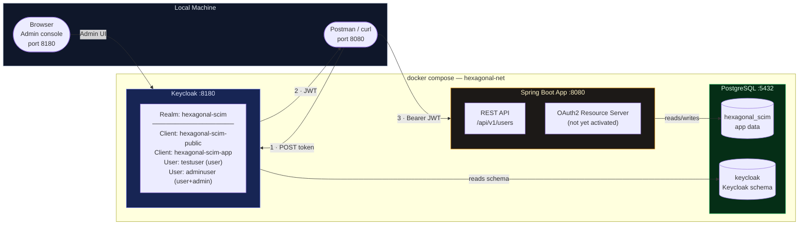
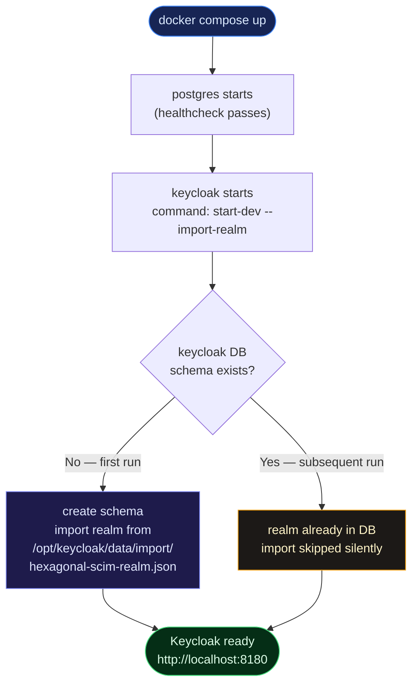

# Keycloak — Local Development Guide

> **Stack**: Keycloak 25.0.6 · PostgreSQL 16 · Docker Compose V2  
> **Admin console**: http://localhost:8180 &nbsp;|&nbsp; `admin` / `admin`  
> **Realm**: `hexagonal-scim` (auto-imported on every `docker compose up`)

---

## Table of Contents

1. [What Is Set Up and Why](#1-what-is-set-up-and-why)
2. [Infrastructure Diagram](#2-infrastructure-diagram)
3. [Start and Stop](#3-start-and-stop)
4. [Credentials Cheat-Sheet](#4-credentials-cheat-sheet)
5. [Get an Access Token](#5-get-an-access-token)
6. [Call the API with a Token](#6-call-the-api-with-a-token)
7. [Inspect and Decode a Token](#7-inspect-and-decode-a-token)
8. [Admin Console Walkthrough](#8-admin-console-walkthrough)
9. [Realm Auto-Import — How It Works](#9-realm-auto-import--how-it-works)
10. [Wipe and Reset Keycloak](#10-wipe-and-reset-keycloak)
11. [Export Realm Changes Back to File](#11-export-realm-changes-back-to-file)
12. [Next Step — Wire Spring Security](#12-next-step--wire-spring-security)

---

## 1. What Is Set Up and Why

### The problem Keycloak solves

The API currently accepts any request without authentication. Before adding
`spring-boot-starter-oauth2-resource-server`, the entire Keycloak infrastructure
needs to be running and pre-configured so that the Spring Security integration
can be dropped in with a single dependency and one config class.

### What is already done

```
docker/
├── keycloak/
│   └── realm-export.json          ← pre-configured realm, imported automatically
└── postgres/
    └── init-keycloak.sql          ← creates keycloak DB on first postgres start
```

| What | Detail |
|------|--------|
| **Keycloak service** | Declared in `docker-compose.yml`, port 8180 |
| **PostgreSQL backend** | Separate `keycloak` database on the shared postgres instance |
| **Realm auto-import** | `docker/keycloak/realm-export.json` mounted and imported via `--import-realm` |
| **Realm name** | `hexagonal-scim` |
| **Two clients** | `hexagonal-scim-public` (Postman/Swagger), `hexagonal-scim-app` (M2M) |
| **Two test users** | `testuser` (user role), `adminuser` (user + admin roles) |
| **Issuer URI pre-wired** | `SPRING_SECURITY_OAUTH2_RESOURCESERVER_JWT_ISSUER_URI` already set in compose |

---

## 2. Infrastructure Diagram



---

## 3. Start and Stop

```bash
# Start everything (first run downloads images and imports the realm — takes 2–3 min)
docker compose up --build

# Start in background
docker compose up --build -d

# Watch logs for a specific service
docker compose logs -f keycloak

# Stop all services (data is preserved in the postgres_data named volume)
docker compose down

# Stop AND wipe all data (realm will be re-imported fresh on next up)
docker compose down -v
```

Keycloak is ready when the logs show:

```
hexagonal-scim-keycloak  | ... Keycloak 25.0.6 on JVM ... started in XX.XXXs
```

---

## 4. Credentials Cheat-Sheet

### Keycloak admin

| Field | Value |
|-------|-------|
| Admin console URL | http://localhost:8180 |
| Username | `admin` |
| Password | `admin` |

> These are bootstrap credentials for local development only.  
> In production, set `KC_BOOTSTRAP_ADMIN_USERNAME` / `KC_BOOTSTRAP_ADMIN_PASSWORD` via secrets.

---

### Realm: `hexagonal-scim`

#### Clients

| Client ID | Type | Use for |
|-----------|------|---------|
| `hexagonal-scim-public` | Public (no secret) | Postman, Swagger UI, browser flows, `curl` testing |
| `hexagonal-scim-app` | Confidential | CI pipelines, service-to-service, machine-to-machine |

Confidential client secret: **`hexagonal-scim-secret`**

#### Test users

| Username | Password | Roles | Email |
|----------|----------|-------|-------|
| `testuser` | `password` | `user` | testuser@example.com |
| `adminuser` | `password` | `user`, `admin` | adminuser@example.com |

#### Realm roles

| Role | Intended meaning |
|------|-----------------|
| `user` | Authenticated user — will map to read-only API access |
| `admin` | Administrator — will map to full CRUD API access |

---

## 5. Get an Access Token

### Option A — Password grant via `curl` (quickest for testing)

Use this during development to get a token for `testuser` or `adminuser`.

```bash
# As testuser (role: user)
curl -s -X POST \
  http://localhost:8180/realms/hexagonal-scim/protocol/openid-connect/token \
  -H "Content-Type: application/x-www-form-urlencoded" \
  -d "grant_type=password" \
  -d "client_id=hexagonal-scim-public" \
  -d "username=testuser" \
  -d "password=password" \
  | jq -r .access_token
```

```bash
# As adminuser (roles: user + admin)
curl -s -X POST \
  http://localhost:8180/realms/hexagonal-scim/protocol/openid-connect/token \
  -H "Content-Type: application/x-www-form-urlencoded" \
  -d "grant_type=password" \
  -d "client_id=hexagonal-scim-public" \
  -d "username=adminuser" \
  -d "password=password" \
  | jq -r .access_token
```

---

### Option B — Client credentials grant (M2M, no user involved)

Use this in CI pipelines or when testing service-to-service scenarios.

```bash
curl -s -X POST \
  http://localhost:8180/realms/hexagonal-scim/protocol/openid-connect/token \
  -H "Content-Type: application/x-www-form-urlencoded" \
  -d "grant_type=client_credentials" \
  -d "client_id=hexagonal-scim-app" \
  -d "client_secret=hexagonal-scim-secret" \
  | jq -r .access_token
```

---

### Option C — Postman OAuth 2.0 tab

1. Open any Postman request → **Authorization** tab → Type: **OAuth 2.0**
2. Click **Get New Access Token** and fill in:

| Postman field | Value |
|---------------|-------|
| Token Name | `hexagonal-scim-local` |
| Grant Type | `Password Credentials` |
| Access Token URL | `http://localhost:8180/realms/hexagonal-scim/protocol/openid-connect/token` |
| Client ID | `hexagonal-scim-public` |
| Username | `testuser` |
| Password | `password` |
| Scope | `openid` |

3. Click **Request Token** → **Use Token**

---

### Token endpoints reference

| Endpoint | URL |
|----------|-----|
| Token | `http://localhost:8180/realms/hexagonal-scim/protocol/openid-connect/token` |
| OIDC discovery | `http://localhost:8180/realms/hexagonal-scim/.well-known/openid-configuration` |
| JWKS (public keys) | `http://localhost:8180/realms/hexagonal-scim/protocol/openid-connect/certs` |
| Userinfo | `http://localhost:8180/realms/hexagonal-scim/protocol/openid-connect/userinfo` |

---

## 6. Call the API with a Token

Save the token into a shell variable then use it in every API call:

```bash
# 1. Get a token and store it
TOKEN=$(curl -s -X POST \
  http://localhost:8180/realms/hexagonal-scim/protocol/openid-connect/token \
  -H "Content-Type: application/x-www-form-urlencoded" \
  -d "grant_type=password&client_id=hexagonal-scim-public&username=testuser&password=password" \
  | jq -r .access_token)

# 2. Use it
# GET all users
curl -i http://localhost:8080/api/v1/users \
  -H "Authorization: Bearer $TOKEN"

# POST create user
curl -i -X POST http://localhost:8080/api/v1/users \
  -H "Content-Type: application/json" \
  -H "Authorization: Bearer $TOKEN" \
  -d '{"email":"alice@example.com","displayName":"Alice"}'

# GET by ID
curl -i http://localhost:8080/api/v1/users/1 \
  -H "Authorization: Bearer $TOKEN"

# PUT full update
curl -i -X PUT http://localhost:8080/api/v1/users/1 \
  -H "Content-Type: application/json" \
  -H "Authorization: Bearer $TOKEN" \
  -d '{"email":"alice-updated@example.com","displayName":"Alice Updated"}'

# PATCH partial update
curl -i -X PATCH http://localhost:8080/api/v1/users/1 \
  -H "Content-Type: application/json" \
  -H "Authorization: Bearer $TOKEN" \
  -d '{"displayName":"Alice Patched"}'

# DELETE
curl -i -X DELETE http://localhost:8080/api/v1/users/1 \
  -H "Authorization: Bearer $TOKEN"
```

> **Note**: The app currently has no `SecurityConfig` — the `Authorization` header is
> accepted and passed through but **not validated** yet. Once Spring Security is wired
> in (see §12), requests without a valid token will return `401 Unauthorized`.

---

## 7. Inspect and Decode a Token

A JWT has three Base64-encoded parts separated by dots: `header.payload.signature`.
You can decode the payload without any library:

```bash
# Decode the payload locally — no network, no external service needed
echo $TOKEN | cut -d. -f2 | base64 -d 2>/dev/null | jq .
```

Key fields in the decoded payload:

```json
{
  "exp": 1715000000,
  "iat": 1714999700,
  "iss": "http://localhost:8180/realms/hexagonal-scim",
  "sub": "some-uuid",
  "preferred_username": "testuser",
  "email": "testuser@example.com",
  "realm_access": {
    "roles": ["user", "default-roles-hexagonal-scim", "offline_access", "uma_authorization"]
  }
}
```

`realm_access.roles` is what Spring Security will read for `@PreAuthorize("hasRole('admin')")`.

---

## 8. Admin Console Walkthrough

Open http://localhost:8180 → log in with `admin` / `admin`.

### Navigate to the realm

1. Click the **realm selector** drop-down (top-left, shows "Keycloak" by default)
2. Select **hexagonal-scim**

### Key sections

| Section | What you can do |
|---------|----------------|
| **Realm settings** | Token lifetimes, brute force protection, email settings |
| **Clients** | View/edit `hexagonal-scim-public` and `hexagonal-scim-app` |
| **Users** | View `testuser` and `adminuser`; reset passwords; assign roles |
| **Roles** | View the `user` and `admin` realm roles |
| **Sessions** | See active sessions; revoke tokens |
| **Events** | Login event log — useful to debug why a token was rejected |

### Add a new test user manually

1. **Users** → **Add user**
2. Fill in username, email, first/last name → **Create**
3. **Credentials** tab → **Set password** → toggle **Temporary** off → **Save**
4. **Role mapping** tab → **Assign role** → select `user` or `admin`

---

## 9. Realm Auto-Import — How It Works



**Source of truth**: `docker/keycloak/realm-export.json`

- This file is version-controlled — every developer gets the same realm automatically.
- Changes made through the Admin console UI are saved in the `keycloak` PostgreSQL database.
- They are **not** written back to the JSON file automatically.
- To persist UI changes for the team → see §11.

---

## 10. Wipe and Reset Keycloak

If the realm ends up in a broken state or you want a clean slate:

```bash
# Stop all services AND delete the postgres_data volume
docker compose down -v

# Start fresh — realm is re-imported from the JSON file
docker compose up -d
```

> All application data (users created via the API) is also wiped.  
> The realm JSON is untouched because it is a bind mount, not a volume.

---

## 11. Export Realm Changes Back to File

If you made changes in the Admin console that you want to commit to the repo:

```bash
# Export the realm from the running Keycloak container
docker exec hexagonal-scim-keycloak \
  /opt/keycloak/bin/kc.sh export \
  --file /tmp/hexagonal-scim-export.json \
  --realm hexagonal-scim

# Copy the export to the host
docker cp hexagonal-scim-keycloak:/tmp/hexagonal-scim-export.json \
  ./docker/keycloak/realm-export.json
```

Then review the diff, commit, and the whole team gets your changes on next `docker compose up -v && docker compose up`.

> ⚠️ The exported file is verbose (includes all default mappers, flows, etc.).  
> Review the diff carefully before committing to avoid noisy PRs.

---

## 12. Next Step — Wire Spring Security

When you're ready to enforce JWT authentication on the API, these are the **only three changes** needed — everything else is already in place:

### Step 1 — Add the dependency to `hex-inbound-adapter-web/pom.xml`

```xml
<dependency>
    <groupId>org.springframework.boot</groupId>
    <artifactId>spring-boot-starter-oauth2-resource-server</artifactId>
</dependency>
```

### Step 2 — Create `SecurityConfig` in `com.example.user.api.config`

```java
@Configuration
@EnableWebSecurity
@EnableMethodSecurity
public class SecurityConfig {

    @Bean
    public SecurityFilterChain securityFilterChain(HttpSecurity http) throws Exception {
        http
            .csrf(AbstractHttpConfigurer::disable)
            .sessionManagement(s -> s.sessionCreationPolicy(STATELESS))
            .authorizeHttpRequests(auth -> auth
                .requestMatchers("/actuator/health", "/swagger-ui/**", "/api-docs/**").permitAll()
                .anyRequest().authenticated()
            )
            .oauth2ResourceServer(oauth2 -> oauth2
                .jwt(jwt -> jwt.jwtAuthenticationConverter(jwtAuthenticationConverter()))
            );
        return http.build();
    }

    private JwtAuthenticationConverter jwtAuthenticationConverter() {
        JwtGrantedAuthoritiesConverter converter = new JwtGrantedAuthoritiesConverter();
        converter.setAuthoritiesClaimName("realm_access.roles");
        converter.setAuthorityPrefix("ROLE_");
        JwtAuthenticationConverter jwtConverter = new JwtAuthenticationConverter();
        jwtConverter.setJwtGrantedAuthoritiesConverter(converter);
        return jwtConverter;
    }
}
```

### Step 3 — Update `docker-compose.yml` app dependency

```yaml
# Change this:
keycloak:
  condition: service_started

# To this (app now waits until Keycloak is fully ready):
keycloak:
  condition: service_healthy
```

Spring Boot will automatically read `SPRING_SECURITY_OAUTH2_RESOURCESERVER_JWT_ISSUER_URI`
(already set in compose) and configure the JWT decoder.  
No `application.yml` changes are needed.

---

## Quick Reference

```bash
# Start
docker compose up -d

# Get token (testuser)
curl -s -X POST http://localhost:8180/realms/hexagonal-scim/protocol/openid-connect/token \
  -d "grant_type=password&client_id=hexagonal-scim-public&username=testuser&password=password" \
  | jq -r .access_token

# Decode token
echo <TOKEN> | cut -d. -f2 | base64 -d | jq .

# Reset everything
docker compose down -v && docker compose up -d

# Export realm back to file
docker exec hexagonal-scim-keycloak /opt/keycloak/bin/kc.sh export \
  --file /tmp/export.json --realm hexagonal-scim
docker cp hexagonal-scim-keycloak:/tmp/export.json ./docker/keycloak/realm-export.json
```

```
URL                              Purpose
────────────────────────────────────────────────────────────────────────────────
http://localhost:8180            Keycloak Admin console
http://localhost:8180/realms/hexagonal-scim/.well-known/openid-configuration
                                 OIDC discovery document
http://localhost:8180/realms/hexagonal-scim/protocol/openid-connect/token
                                 Token endpoint
http://localhost:8080/api/v1/users
                                 API (no auth yet — add Bearer once security wired)
http://localhost:8080/swagger-ui.html
                                 Swagger UI
```

---

*Generated for `hexagonal-scim` — hexagonal (ports & adapters) Spring Boot service.*

